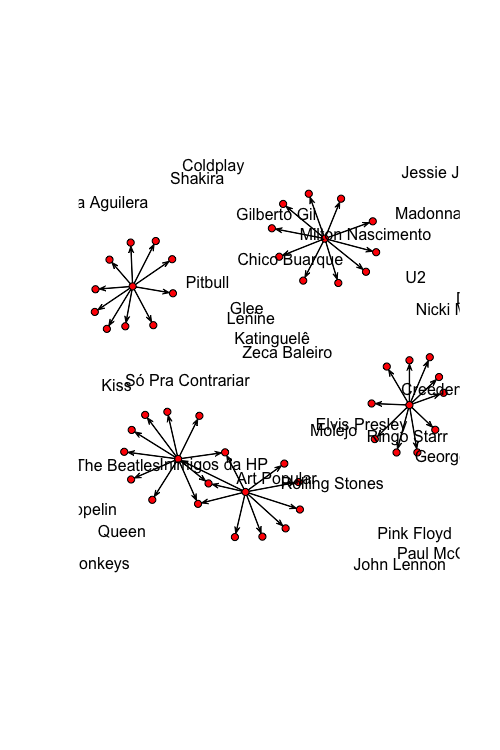
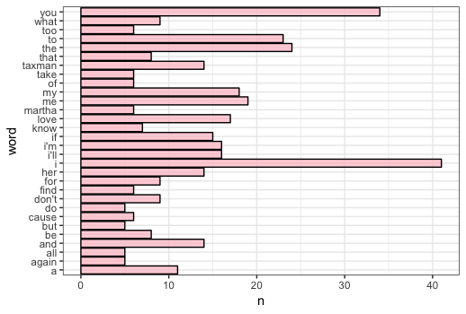

vagalumeR: Access the Vagalume API via R
========================================

This package allows you to access the Vagalume API via R. You can get information about specific artists/bands, as their related artists, and information about the lyrics, as the top lyrics of an artist/band and the text of a song itself.

The `vagalumeR` package is developed under version control using Git and is hosted in GitHub. You can download it from GitHub using `devtools`:


**If you enjoy this work, consider [buying me a coffee in Ko-Fi](ko-fi.com/brunawundervald), or Paypal:**

<p align="center">
  <a href="https://www.paypal.com/cgi-bin/webscr?cmd=_s-xclick&hosted_button_id=89DH4WYL2M7XW&source=url">
    
  </a>
</p>

**so I can keep developing and maintaining this package :)**


# vagalumeR: Access the Vagalume API via R #

This package allows you to access the Vagalume API via R. You can get
information about specific artists/bands, as their related artists,
and information about the lyrics, as the top lyrics of an artist/band
and the text of a song itself. 

The `vagalumeR` package is developed under control version using Git 
and is hosted in GitHub. You can download it from GitHub using `devtools`:
``` r
# install.packages("devtools")
devtools::install_github("brunaw/vagalumeR")
```

For exploring the content of the package, you may try:
``` r
library(vagalumeR)
packageVersion("vagalumeR")
ls("package:vagalumeR")
help(package = "vagalumeR")
```

------------------------------------------------------------------------

Some examples of the usage of this package are below:
``` r
library(vagalumeR)
```

First of all, you'll need one API key, that can be obtained at the 
[Vagalume Website](https://auth.vagalume.com.br/settings/api/). You'll
need to register at the Website for that. 
``` r
library(tidyverse)
# Copy and paste your api key at the following object:
key <- "putyourapikeyhere"

artists <- c("the-beatles", "madonna", "chico-buarque",
             "the-rolling-stones", "molejo")

artists %>%  map_dfr(artistInfo)

#                 id           name views  pos period uniques points
# 1 3ade68b3gce86eda3    The Beatles 68965   15 201902   30269   42.9
# 2 3ade68b3g1f86eda3        Madonna 16728  130 201902    7992   11.9
# 3 3ade68b4g66c6eda3  Chico Buarque 23478   95 201902    9634   14.3
# 4 3ade68b6g28c9eda3 Rolling Stones  8406  140 201901    4528   11.7
# 5 3ade68b5g2f48eda3         Molejo  1410 1078 201902     712    1.5
```

Where:

  - `id` is the identifier of the artist/band;
  - `name` is the name of  the artist/band;
  - `views` is the number of views received by the artist/band at the
  Vagalume Website;
  - `pos` is the position of the artist/band at the Vagalume Ranking;
  - `period` is the period of evaluation;
  - `uniques` counts the number of unique views of the artist/band;
  - `points` is the pontuation of the artist/band at the Vagalume 
  Ranking;

``` r
rel <- artists %>%  map_dfr(relatedInfo)

rel[sample(nrow(rel), 10), ]

#                   id           name            rel.id        related
# 22 3ade68b4g66c6eda3  Chico Buarque 3ade68b5gf7e7eda3   Gilberto Gil
# 5  3ade68b3gce86eda3    The Beatles 3ade68b6g28c9eda3 Rolling Stones
# 40 3ade68b6g28c9eda3 Rolling Stones 3ade68b5g1bf7eda3          Queen
# 6  3ade68b3gce86eda3    The Beatles 3ade68b5gc5a8eda3  Elvis Presley
# 38 3ade68b6g28c9eda3 Rolling Stones 3ade68b5gc5a8eda3  Elvis Presley
# 16 3ade68b3g1f86eda3        Madonna 3ade68b7g424c1ea3       Jessie J
# 8  3ade68b3gce86eda3    The Beatles 3ade68b5g1bf7eda3          Queen
# 26 3ade68b4g66c6eda3  Chico Buarque 3ade68b5g7d48eda3 Maria Bethânia
# 39 3ade68b6g28c9eda3 Rolling Stones 3ade68b5gd237eda3           Kiss
# 42 3ade68b5g2f48eda3         Molejo 3ade68b3g9d86eda3    Art Popular
```

Where:

  - `rel.id` is the identifier of the related band/artist;
  - `related` is the name of the related band/artist;


``` r
library(network)
df <- data.frame(rel$name, rel$related)
net <- network(df)
plot(net, label = network.vertex.names(net))
```




``` r
songs <- artists %>%  map_dfr(songNames)

songs[sample(nrow(songs), 10), ]

#                    id           name           song.id                       song
# 789  3ade68b4g66c6eda3  Chico Buarque 3ade68b8gf2982fa3             Deixa A Menina
# 236  3ade68b3gce86eda3    The Beatles 3ade68b6g1bddfda3        Rock and Roll Music
# 1650 3ade68b5g2f48eda3         Molejo 3ade68b8g65559fa3                  Tiro Onda
# 64   3ade68b3gce86eda3    The Beatles 3ade68b6gf2edfda3          Don't Ever Change
# 832  3ade68b4g66c6eda3  Chico Buarque 3ade68b8g1562eea3             Festa Imodesta
# 1096 3ade68b4g66c6eda3  Chico Buarque 3ade68b6gbcc1fda3                 Vai Passar
# 1415 3ade68b6g28c9eda3 Rolling Stones 3ade68b6g310feda3      Rock And A Hard Place
# 1276 3ade68b6g28c9eda3 Rolling Stones 3ade68b7g3f4b3ea3                Honest I Do
# 861  3ade68b4g66c6eda3  Chico Buarque 3ade68b7g48388ea3                 Imagina Só
# 152  3ade68b3gce86eda3    The Beatles 3ade68b6g47ddfda3 In Spite Of All The Danger
```

Where:

  - `song.id` is the identifier of the song;
  - `song` is the name of the song;

``` r

lyr <- songs %>% 
  filter(name == "The Beatles") %>% 
  sample_n(5) %>% 
  pull(song.id) %>% 
  map_dfr(lyrics, artist = "The Beatles", type = "id", key = key,
          message = FALSE)

glimpse(lyr)

# Observations: 5
# Variables: 8
# $ id          <chr> "3ade68b4g7d96eda3", "3ade68b7g585fbea3", …
# $ name        <chr> "the beatles", "the beatles", "the beatles…
# $ lang        <int> 2, 2, 2, 2, 2
# $ text        <chr> "I don't want to spoil the party so I'll g…
# $ song.id     <chr> "3ade68b4g7d96eda3", "3ade68b7g585fbea3", …
# $ song        <chr> "the beatles", "the beatles", "the beatles…
# $ language    <int> 1, 1, 1, 1, 1
# $ translation <chr> "[Eu não quero estragar a festa]  Eu não q…
```

Where:

  - `song` is the name of the song;
  - `lang` is the language of the song (1 = portuguese,
  2 = english)
  - `text` is the lyrics text of the song;
  - `translation` is the translation text of the song;

``` r
library(tidytext)

count_words <- lyr %>% 
  unnest_tokens(word, text) %>% 
  count(word) %>% 
  arrange(desc(n)) %>% 
  slice(1:30)

# Shows the most common words in songs from The Beatles
count_words %>% 
  ggplot(aes(word, n)) +
  geom_bar(stat = "identity", fill = "pink", colour = "black", 
           alpha = 0.7) +
  coord_flip() +
  theme_bw()
```



